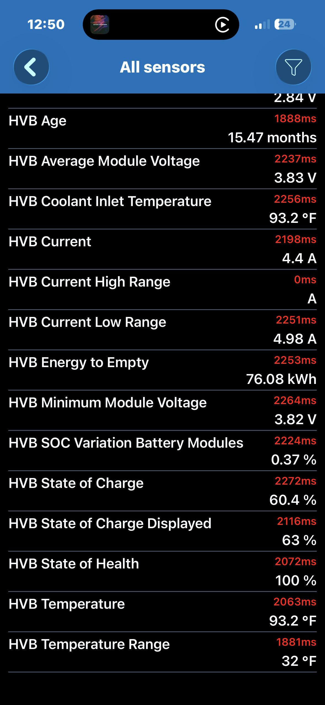

# Battery dashboard

High-voltage battery (HVB) state for the F-150 Lightning, plus the 12V (LVB).
9 tiles — under the CarPlay 10-PID cap.

> **Verified on-vehicle 2026-06-13** — 2025 F-150 Lightning Flash (123 kWh pack),
> OBDLink MX+ (Bluetooth Classic) + Car Scanner iOS. The HVB PIDs below read live
> on this truck — the 2025 Flash is **not** OBD-firewalled. Values captured at ~63%
> displayed SOC, charger unplugged, truck in Ready. Hex/formulas confirmed against
> the MachEforum PID sheet and cross-checked against the live readings.

## PID definitions

| Parameter | Header | Command | Formula | Unit | Live | Status |
|---|---|---|---|---|---|---|
| HVB State of Charge | (default) | `0x224801` | `INT16(A:B)*0.002` | % | 60.4 | ✅ verified |
| HVB pack voltage | `7E2` | `0x22480D` | `INT16(A:B)*0.01` | V | 343 | ✅ verified |
| HVB pack current | `7E2` | `0x22480B` | `((signed(A)*256)+B)*0.02` | A | 4.4 | ✅ verified |
| HVB power | — | computed | `val{HVB pack voltage}*val{HVB pack current}*0.001` | kW | 2.2 | ✅ computed |
| HVB pack temperature | (default) | `0x224800` | `(A-50)*1.8+32` | °F | 93.2 | ✅ verified |
| HVB state of health | — | TODO | TODO | % | 100\* | ⚠️ TODO |
| HVB energy to empty | (default) | `0x224848` | `INT16(A:B)*0.002` | kWh | 76.08 | ✅ verified |
| 12V (LVB) State of Charge | — | TODO | TODO | % | — | ⚠️ TODO |
| 12V (LVB) voltage | — | TODO | TODO | V | — | ⚠️ TODO |

\* SOH read **100%** live from Car Scanner's built-in profile, but its PID/formula
isn't in the MachEforum Torque sheet we verified from — left TODO until the hex is
captured (see Notes).

## Byte & function conventions

- `A, B, C, D` — data bytes of the mode-22 positive response, in order.
- `INT16(A:B)` = `A*256 + B` (unsigned 16-bit).
- `signed(A)` — two's-complement signed byte (so pack current goes negative on
  regen / charge).
- `val{Name}` — the live value of another PID (used by computed PIDs).
- **Header** — the request CAN ID (ECU). `(default)` = the Lightning profile's
  default request; confirm the header if you import the PID standalone.

## Layout / order (most-important first, ≤10 — CarPlay cap)

1. HVB State of Charge
2. HVB pack voltage
3. HVB pack current
4. HVB power (computed)
5. HVB pack temperature
6. HVB state of health
7. HVB energy to empty
8. 12V (LVB) State of Charge
9. 12V (LVB) voltage

## Notes

- Units are **°F** (app set to imperial). Car Scanner also exposes `HVB State of
  Charge Displayed` (`0x224845`, header `7E4`, `A*0.5`) — the buffered % the cluster
  shows (63% live vs 60.4% true SOC). Swap it in if you want the dash number.
- **HVB power** is computed from the two tiles above. The MachEforum sheet's native
  "HV Battery Power Flow Calculated" instead multiplies `HVB Voltage` by `HVB Current
  Low Range` (`0x22480A`) — equivalent; cross-checks to the native `HV EV Battery
  Power` reading (2.98 hp = 2.2 kW at 343 V × 6.5 A).
- The three `TODO` rows (SOH, 12V SOC, 12V voltage) weren't in the Torque CSV we
  pulled. Grab rows `HVB State of Health`, `LVB State of Charge`, `LVB Voltage` from:
  - https://www.f150lightningforum.com/forum/threads/pid-list-to-monitor-your-lightning.13563/
  - https://www.macheforum.com/site/threads/ford-mustang-mach-e-extended-pids-for-torque-project.7427/

## Screenshots

_Screenshot pending — embeds are commented out until the PNGs are committed (avoids
broken-image icons on GitHub)._

<!--  -->
<!--  -->
