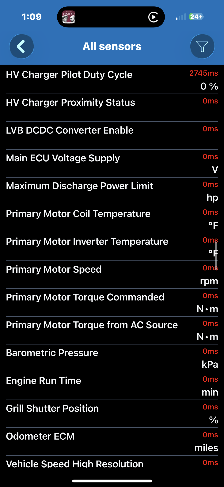

# Performance dashboard

Drivetrain power and thermals for the F-150 Lightning. 6 PIDs — under the CarPlay
10-PID cap.

## PID definitions

| Parameter | Header | Mode+PID | Formula | Unit | Status |
|-----------|--------|----------|---------|------|--------|
| HVB pack voltage | TODO | TODO | TODO | V | TODO — from PID sheet |
| HVB pack current | TODO | TODO | TODO | A | TODO — from PID sheet |
| Instantaneous power | — | computed | `voltage × current ÷ 1000` (regen negative) | kW | computed (inputs TODO) |
| Motor temperature | TODO | TODO | TODO | °C | TODO — from PID sheet |
| Inverter temperature | TODO | TODO | TODO | °C | TODO — from PID sheet |
| HVB State of Charge | `7E6` | `22 4801` | TODO — confirm scaling | % | UNVERIFIED — confirm against the PID sheet |

## Layout / order

Most-important first, ≤10 PIDs (CarPlay caps a page at 10):

1. Instantaneous power (kW, regen negative)
2. HVB pack current
3. HVB pack voltage
4. Motor temperature
5. Inverter temperature
6. HVB State of Charge

(Power leads — it's the number you watch while driving. Voltage and current feed
it; they sit just below.)

## 0–60 / acceleration

**0–60 is not a PID.** Use Car Scanner's built-in acceleration tool:
**Menu → Acceleration measurement** (a.k.a. the Dyno / 0–100 tool). It times
0–60 mph (and 1/4 mile etc.) from the speed signal — no custom PID needed. Run it
on a closed course / safe road.

## Notes

- **Instantaneous power** is a virtual/computed PID: `voltage × current ÷ 1000`.
  Sign follows current, so regen reads negative. Structurally defined now; real
  values once voltage + current hex are verified and filled.
- The SOC row reuses the `7E6` / `22 4801` candidate — `UNVERIFIED`, confirm
  before relying on it.
- Verify every `TODO`/`UNVERIFIED` hex against the community PID sheets:
  - https://www.f150lightningforum.com/forum/threads/pid-list-to-monitor-your-lightning.13563/
  - https://www.macheforum.com/site/threads/tips-on-using-carscanner-elm-app-with-obd2-for-custom-data-display-ver-1-87-1-and-later.12627/
  The Lightning shares the Mach-E mode-22 PID set.

## Screenshots

_Screenshot pending._

